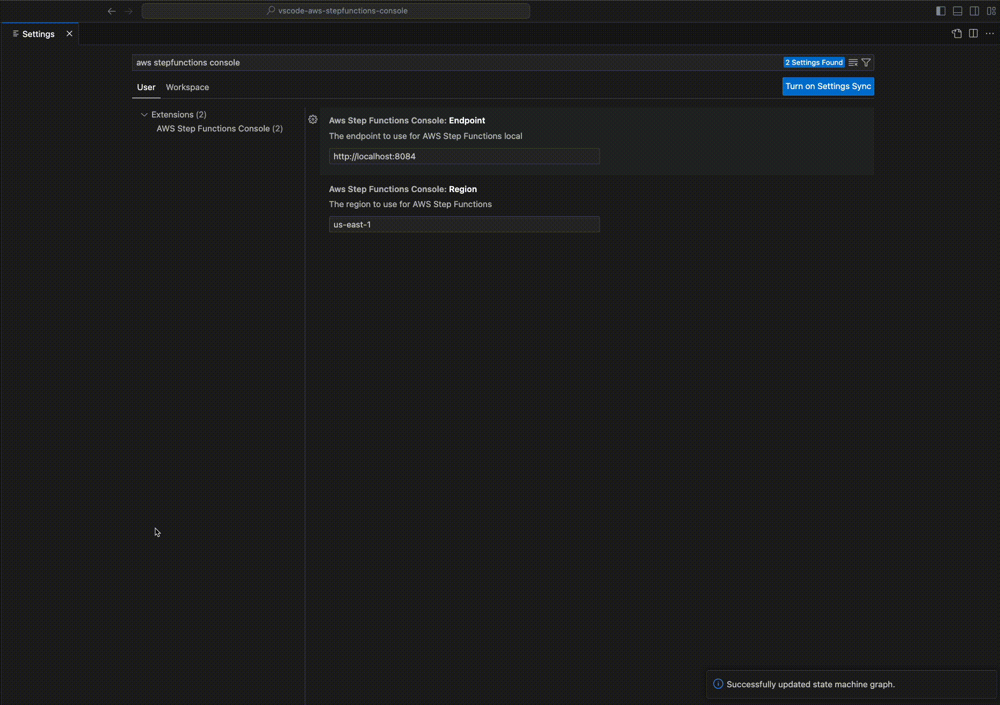

# vscode-aws-stepfunctions-console
VS Code Extension to browse AWS Stepfunctions state machines and executions

## Features
* AWS Stepfunctions local support
* List state machines and executions
* Graph representation of state machine definitions and executions
* State input and output

## Requirements
* AWS credentials or AWS Stepfunctions local

## Extension Settings
* `awsStepFunctionsConsole.enable`: Enable/disable this extension.
* `awsStepFunctionsConsole.region`: The region to use for AWS Step Functions.
* `awsStepFunctionsConsole.endpoint`: The endpoint to use for AWS Step Functions local.
